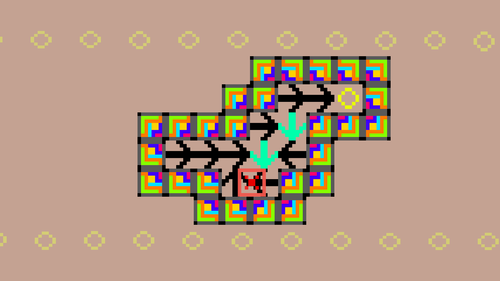

_from the AI-generated chat..._

```
I've had a break from the barelyjams project for a few weeks, and it's time to go back to it! I've
liked all the ideas before, but since it's been a few weeks inbetween, I'd like to start a fresh
idea today for the second entry of the project! I still would like it to be as different as possible
from the first entry, bouncy beats, and I still would like to have a 2D game concept this time,
potentially a puzzle game or similar, but note that I don't have any real experience with creating
2D assets. I also would like to focus more on the Performer component of barelymusician rather than
the Instrument as I did in the first entry. Also note that the entries do not have to be strictly
games, and can be more like interactive toys, or audio visual experiences if there is a compelling
reason.

Given all that above, can you kickstart the second entry for the barelyjams project with new ideas?
```

Here are a few fresh ideas for your second entry into *Barelyjams*, building on your desire for a 2D
concept, a focus on the *Performer* component of *barelymusician*, and exploration of puzzle
mechanics or interactive audio-visual experiences:

---

### 1. **"Beat Blocks" – A Rhythm-Powered Puzzle Builder**
**Concept:**
A minimalist 2D puzzle where players place and rearrange looping "blocks" that perform actions in
rhythm. Each block is a Performer task tied to a specific note, rhythm, or sequence, and together
they create a musical piece while solving a spatial puzzle. For example:
- A "conveyor block" moves an object every beat.
- A "switch block" toggles on/off states in rhythm.
- A "launcher block" releases objects to the beat.

**Gameplay Loop:**
Players must align these looping blocks into a functional contraption to achieve a goal, such as
getting a marble from start to finish. The challenge comes from syncing the rhythms of the blocks to
align actions correctly.

**Why it’s cool:**
- Performer tasks act as musical loops, and solving the puzzle builds a rhythmically satisfying
  audio experience.
- Simple 2D visuals: Blocks can be color-coded squares with basic animations (e.g., pulsing on the
  beat).
- As players solve puzzles, the music dynamically "builds up," rewarding success.

---

### 2. **"Chimeflow" – A Musical Water Simulation Toy**
**Concept:**
An interactive audio-visual experience where users direct a flowing stream of particles (like water
or sand) through 2D channels and obstacles. Performers control the rhythm and "chime" of the flow,
creating soothing generative music as the particles hit surfaces or pass through areas.

**Mechanics:**
- Particles trigger Performers that play notes or loops when they collide with objects.
- Players can draw, delete, or adjust paths to redirect the flow and create new rhythms or
  harmonies.
- Optional puzzles could involve hitting certain targets in rhythm or synchronizing particle flows.

**Why it’s cool:**
- A calming, sandbox-style experience with emergent musical results.
- Visually minimalistic but engaging: flow lines, particle trails, and chime-trigger feedback can be
  simple to render.
- Focus on the Performer component: rhythms emerge naturally as particles interact with the system.

---

### 3. **"Loop Weaver" – A Rhythm-Based Timeline Puzzle**
**Concept:**
A 2D grid-based puzzle where players manipulate a looping timeline of Performer tasks to achieve
goals. Each row on the grid represents a looping "channel" of actions (e.g., triggering notes,
moving objects), and players must adjust the timing and positions of these tasks to align actions
across channels.

**Gameplay Loop:**
- The puzzle begins with a looping timeline where tasks are out of sync.
- Players drag and drop Performers (e.g., note triggers, object movers) onto the grid to correct the
  rhythm and solve the puzzle.
- Completing a puzzle creates a coherent musical loop.

**Why it’s cool:**
- Combines Performer-driven rhythms with logical puzzle-solving.
- Minimal visuals: the grid and looping animations of tasks can be simple to implement.
- Puzzles become increasingly complex as layers of tasks interlock musically.

---

### 4. **"Pulse Garden" – A Generative Music Sandbox**
**Concept:**
A relaxing, abstract audio-visual experience where players "plant" and arrange musical objects on a
2D canvas. Each object loops a Performer task (e.g., a note or rhythm) that contributes to the
overall musical landscape.

**Mechanics:**
- Different objects represent different Performers: for example, a "tree" plays slow, low-pitched
- notes, while a "flower" triggers higher, rhythmic sounds.
- Players interact with the objects to adjust parameters like pitch, speed, or volume.
- Objects visually pulse or animate in sync with their rhythms, creating a living, musical "garden."

**Why it’s cool:**
- Focuses entirely on Performers, creating a dynamic musical system.
- Minimal 2D visuals: abstract shapes or plant-like objects with simple animations.
- Accessible and meditative – no need for explicit goals or challenges.

---

### 5. **"Shift Beats" – A Time-Sliding Rhythm Puzzle**
**Concept:**
A 2D puzzle game where players must shift the "timing" of looping Performers to complete tasks. For
example:
- A conveyor belt moves an object every beat, and the player must adjust the beat timing to sync
  with other Performers.
- Doors open and close on loops, and the player must align rhythms to navigate objects or solve
  spatial challenges.

**Gameplay Loop:**
Players adjust sliders, toggle switches, or reposition Performers on a timeline to create
synchronized solutions. Solving the puzzle generates a satisfying musical rhythm.

**Why it’s cool:**
- A blend of timing puzzles and music generation using Performers.
- Minimal, clean visuals: grids, timelines, and objects with basic animations.
- Players get immediate musical feedback when they "solve" timing conflicts.

---

Each of these ideas embraces the Performer component of *barelymusician*, explores fresh gameplay or
interactive concepts, and minimizes reliance on complex 2D assets. Let me know if any of these stand
out, or if you want to mix and match ideas!

```
I liked the ideas 1. "Beat Blocks" – A Rhythm-Powered Puzzle Builder , 3. "Loop Weaver" – A
Rhythm-Based Timeline Puzzle, and 4. "Pulse Garden" – A Generative Music Sandbox. Can you mix and
match the concepts to create a new suggestion based on that?
```

Sure! Here's a mixed and refined concept that combines the best elements of **"Beat Blocks"**,
**"Loop Weaver"**, and **"Pulse Garden"** into something fresh and cohesive:

---

### **"Rhythm Grove" – A Musical Puzzle Garden**

**Concept:**
"Rhythm Grove" is a hybrid of a rhythm-based puzzle game and a sandbox experience where players
"grow" a musical environment by solving looping timeline challenges. Each solution contributes to
building a beautiful, generative audio-visual "grove" of rhythmically active elements.

---

### **Core Gameplay Mechanics:**

1. **Tile-Based Musical Puzzles**
   - The game starts with an empty grid where players place and arrange "rhythm tiles" (e.g.,
     *Beat Tiles*, *Pulse Tiles*, or *Flow Tiles*), each tied to looping **Performer tasks** (like
     triggering notes, moving objects, or controlling flow).
   - Each tile has a simple looping action—e.g., hitting a note, opening a gate, or shifting an
     object every X beats.
   - Players solve puzzles by aligning these tiles' loops so that their rhythms synchronize,
     triggering actions in the right order to achieve goals like moving objects, activating paths,
     or hitting targets.

1. **Growing the Grove**
   - When a puzzle is solved, the grid "grows" a corresponding element in the *grove*.
   - Each completed tile activates its Performer, adding notes, rhythms, or melodic phrases to the
     background music. The more puzzles you solve, the richer and more layered the grove's music
     becomes.
   - Elements visually bloom: think trees pulsing with bass notes, flowers shimmering with higher
     rhythms, or streams flowing to delicate arpeggios.

1. **Timeline Adjustments**
   - Each tile can be adjusted on a looping "timeline" to tweak its Performer tasks:
     - For example, shift the beat offset, extend the duration, or alter its rhythm.
   - Players use this timeline manipulation to align loops and solve the puzzles, but also to
     fine-tune the musical outcome.

---

### **Player Experience:**

- **Puzzle Challenges**:
   Players progress through levels where grid-based puzzles get more intricate—more tiles to sync,
   dynamic obstacles (like gates opening/closing on loops), or specific rhythm targets.

- **Sandbox Layer**:
   After completing a puzzle, players unlock and arrange new musical elements in their grove, which
   remains persistent. You can return to fine-tune the timeline of existing elements to perfect the
   musical harmony or visual layout.

- **Emergent Music**:
   The background music is entirely generated through Performers tied to the tiles and grid state.
   As players solve puzzles and expand their grove, the soundtrack grows into a unique, evolving
   composition.

---

### **Why It’s Cool:**
- **Performer Focus**: The grid tiles and timeline adjustments allow you to lean heavily on the
  Performer system to drive rhythmic gameplay.
- **Interactive Musical Payoff**: Solving puzzles isn't just about logic—it feels like building
  music step by step. The reward is both functional and aesthetic: a lush audio-visual grove.
- **Minimal Art Requirements**: Visuals can stay abstract but elegant—colorful pulse animations,
  flowing lines, and rhythmic bloom effects that react to the Performers.
- **Replayable Sandbox**: Players can continue to grow and tweak their grove, turning it into a
  dynamic generative music piece.

---

### **Visual Inspiration:**
- Think simple geometric tiles for puzzles.
- A "grove" made of abstract, musical plants that pulse, shimmer, and flow in sync with the music.
- Particle trails for rhythm flows or objects moving on the beat.

This concept combines puzzle-solving, emergent music, and sandbox creativity into one cohesive loop,
offering a satisfying experience that grows both visually and musically over time. Let me know how
this sounds! 🎵

```
Okay I think I'm starting to visualize what it can look like. We'd have a grid layout level, where
each tile would be one of the rhythm tiles in a certain state, typically looping back to itself
forever unless the user starts giving an input. Then, the user would start tweaking the interactable
tiles to move out of the loop and get to the next level represented by a special finish tile. Then
the music keeps going seamlessly into the next level converting the finish tile to start tile for
the next level. I think we can go ahead with creating a roadmap to make this game in the next few
days! So let's kickstart the entry 2
```

Great progress! I love how you're starting to see this rhythm puzzle game come together.

---

### **Next Steps: Entry 2 Roadmap**

#### **Day 1: Core Gameplay Design**
- Finalize the grid behavior: tiles loop indefinitely unless adjusted.
- Implement the basic grid layout and visual feedback for tiles (e.g., pulsing states).
- Design and implement the **interactable tile types** (e.g., trigger tile, gate tile, bounce tile).
- Prototype character movement: hopping to tiles in time with the beat.

#### **Day 2: Puzzle Logic and Progression**
- Add tile interaction mechanics:
   - Adjusting rhythm (e.g., beat length and phase).
   - Synchronizing tile actions with the character’s movement.
- Add a goal mechanic: special “finish tile” completes the level.
- Seamlessly transition to the next level with the finish tile turning into the next start tile.

#### **Day 3: Visuals and Audio Integration**
- Create visual states for tiles: idle (looping), activated, and adjusted.
- Add visual and audio feedback for character movement (e.g., “hop” sounds and glowing trails).
- Layer background music and dynamic rhythm tiles to build the soundtrack as levels progress.

#### **Day 4: Polish and Gameplay Testing**
- Polish movement animations and tile visuals for clarity.
- Test and fine-tune rhythm puzzles for fun and challenge.
- Add simple onboarding (e.g., the first levels teach tile interactions step-by-step).

---

With this roadmap, you'll have a clear plan to kick off Entry 2 while keeping the rhythm-focused
gameplay front and center. Let me know what you think or if you'd like adjustments! 🚀

```
I think the character can be some sort of a mouth doing vocal chords, and change slightly depending
on the pitch in a comedic manner, which can also give some personality to the game. Since we have
tweaked the game idea a bit, can you come up with a new name for this entry, and let's kickstart the
game dev!
```

### New Name for Entry 2: **"Mouthful of Beats"**
This playful title highlights the comedic, vocal nature of the player character while keeping rhythm
and progression central to the concept.

---

Let’s generate a visual concept for your game. Picture this:

- A **top-down grid layout** with rhythm tiles pulsing and glowing to the beat.
- A **cartoonish mouth character** hopping or “singing” its way from tile to tile, exaggerated to
  match comedic vocal sounds and pitch.
- Each tile may visually pulse with distinct rhythms—using color, size, or patterns to convey
  different beat states.
- A fun, dynamic visual style with quirky and energetic elements to reflect the rhythm and humor.

---

```
Actually, one more thing, if the character splits into multiple paths in the game, we probably do
not want to limit the music to vocals only, so maybe the character can be multiple of shapes like
other instruments, or concepts. For instance, I can totally see a place where multiple characters
loops at the same time, one with the vocal, the main character, another doing percussion in parallel
to creating a backing drums. Can you update the name focusing a bit more on the level design of
finite number of tiles, rather than the whole map filled with grids?
```

### **Updated Name: “Tile Tunes”**
This name keeps the playful spirit of the original while emphasizing the puzzle element of working
with a finite set of tiles to manipulate the rhythm and progress through levels.

---

Now, let’s update the image concept:
- **Finite rhythm tiles** arranged deliberately in smaller patterns rather than filling the whole
  map.
- The grid now feels more like puzzle "paths" or islands of rhythm.
- A quirky ensemble of characters (the vocal mouth, drum, and others) interact with specific rhythm
  tiles to solve puzzles.
